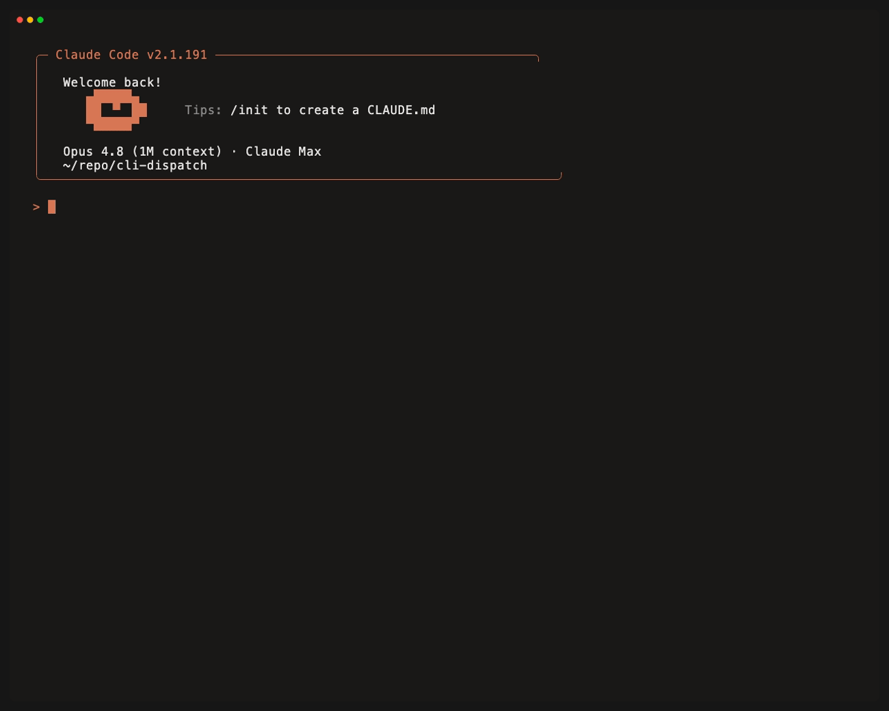

# cli-dispatch

> 🌐 **Languages:** **English** · [Türkçe](README.tr.md)

A Claude Code plugin that **delegates a task to the right worker CLI** — a multi-backend delegation hub. Backends: **DeepSeek-powered Claude Code** (`claude-ds`), **Antigravity / Gemini** (`agy`, via `ag-agent`), and **OpenAI Codex CLI** (`codex`, via `cx-agent`).

> ℹ️ **Multi-backend delegation hub.** Three worker backends today — **DeepSeek** (commands `/cli-dispatch:ds-*`), **Antigravity/Gemini** (`/cli-dispatch:ag-run`, wrappers `ag-agent`/`ag-stream`), and **Codex** (`/cli-dispatch:cx-run`, wrappers `cx-agent`/`cx-stream`). You pick which to install at setup. All three write to the same session layout, so `sessions`/`watch` work across all. The DeepSeek wrapper/config paths keep the `claude-ds` name (that backend's name).

Claude Code's built-in `Agent`/subagent tool only supports Anthropic models (sonnet/opus/haiku) — it can't hand work to DeepSeek or Gemini. cli-dispatch installs portable wrappers that drive each worker CLI (Claude Code against DeepSeek's API; the Antigravity CLI for Gemini), so you can hand tasks to either as a **delegated worker**.

> 📝 **Write-up (Turkish):** [cli-dispatch: a plugin that makes Claude the boss and DeepSeek the worker](https://medium.com/@rbinar/cli-dispatch-claudea-patron-deepseek-e-i%CC%87%C5%9F%C3%A7i-rol%C3%BC-veren-bir-plugin-b232803581fc) — Medium



## Install

> ⚠️ These commands are **slash commands** and must be run **from inside the Claude Code CLI** (not in a normal terminal/shell). First type `claude` to start a Claude Code session, then enter the commands at that session's prompt.

Run the commands **one at a time, in order** — don't paste them all at once. Send each command, wait for the result, then move to the next:

**Step 1 — Add the marketplace:**

```text
/plugin marketplace add rbinar/cli-dispatch
```

> If an "Enter marketplace source" box opens, type **only the source** into it (not the command): `rbinar/cli-dispatch`

**Step 2 — Install the plugin** (after the marketplace is added):

```text
/plugin install cli-dispatch@cli-dispatch
```

> The format is `plugin-name@marketplace-name`; since both are `cli-dispatch` the name repeats, which is normal.

**Step 3 — Enable the plugin:**

The install output says `Run /reload-plugins to apply`. This step is required for the commands (`/cli-dispatch:ds-*`) to be recognized:

```text
/reload-plugins
```

> If you still get "Unknown command: /cli-dispatch:setup" after reload, fully quit Claude Code and reopen it. You can verify `cli-dispatch` is installed and **enabled** with the `/plugin` command.

**Step 4 — Run setup** (after the plugin is enabled):

```text
/cli-dispatch:setup
```

`/cli-dispatch:setup` first **asks which worker backend(s) to install** — DeepSeek, Antigravity (Gemini), Codex, or all (`--backends all` or `--backends deepseek,antigravity,codex`). For **DeepSeek** it installs the wrapper to `~/.local/bin/claude-ds` and creates a `~/.config/cli-dispatch/config` skeleton; if the key is still empty, setup **automatically opens the config in your platform's default editor** (macOS `open`, Linux `xdg-open`, WSL `explorer.exe`, Windows `notepad`). Add your DeepSeek API key **yourself** in the opened file:

```bash
# ~/.config/cli-dispatch/config
DEEPSEEK_API_KEY="sk-..."     # your own DeepSeek key
DS_MODEL="deepseek-v4-pro"
DS_FLASH_MODEL="deepseek-v4-flash"
```

> Want a different editor? Set the `CLI_DISPATCH_EDITOR` environment variable (e.g. `CLI_DISPATCH_EDITOR="code"`; the legacy `CLAUDE_DS_EDITOR` is still honored). If auto-open fails, open the file manually: `${EDITOR:-nano} ~/.config/cli-dispatch/config`.

For the **Antigravity (Gemini)** backend, setup installs `ag-agent`/`ag-stream` instead. It needs the `agy` CLI (`curl -fsSL https://antigravity.google/cli/install.sh | bash`) plus `script` (pseudo-TTY) and `node`; auth is via Google sign-in (run `agy` once) or a `GEMINI_API_KEY`. Native Windows: DeepSeek only — use WSL for the Antigravity backend. agy proxies **multiple model families** — pick one with `ag-agent --model "<name>"` (or the `AG_MODEL` config default): `Gemini 3.1 Pro (High)`, `Claude Opus 4.6 (Thinking)`, `GPT-OSS 120B (Medium)`, … (run `agy models` for the exact list; default `Gemini 3.5 Flash (High)`).

For the **Codex (OpenAI Codex CLI)** backend, setup installs `cx-agent`/`cx-stream`. It needs the `codex` CLI (≥ 0.142.3: `npm i -g @openai/codex`, `brew install --cask codex`, or `curl -fsSL https://chatgpt.com/codex/install.sh | sh`) plus `node`; auth is via `codex login` (ChatGPT/OAuth — no API key needed for personal use) or `CODEX_API_KEY` (takes precedence) or `OPENAI_API_KEY`. Select a model with `cx-agent --model <name>` (or the `CX_MODEL` config default; blank = codex's own default): `gpt-5.5` (default), `gpt-5.4`, `gpt-5.4-mini` (fast/cheap, subagents), `gpt-5.3-codex-spark` (run `/model` inside codex for the live list). **Key advantage:** `cx-agent --read-only` activates codex's **real OS-level sandbox** (macOS Seatbelt / Linux bwrap+seccomp) — a kernel-enforced hard-block on all file writes, not just tool-layer restriction.

Requirements: the `claude` CLI installed and `~/.local/bin` on PATH. DeepSeek key: https://platform.deepseek.com/api_keys

## Usage

You use claude-ds **from inside Claude Code** — two ways:

1. **Slash commands** (table below) — typed at the `claude` session's prompt.
2. **Natural language** — say "do this with deepseek", "delegate this to claude-ds"; the skill kicks in and Claude Code runs the work.

| Command | What it does |
|---------|--------------|
| `/cli-dispatch:setup` | Pick backend(s) + install + config skeleton + smoke test |
| `/cli-dispatch:ds-run <task>` | Delegate a task to **DeepSeek** (session-tracked; worktree isolation for repo tasks) |
| `/cli-dispatch:ag-run <task>` | Delegate a task to **Antigravity (Gemini)** (same workflow) |
| `/cli-dispatch:cx-run <task>` | Delegate a task to **Codex (OpenAI)** (real read-only sandbox; same session layout) |
| `/cli-dispatch:sessions` | List past/active sessions (all backends; shows a `backend` column) |
| `/cli-dispatch:ds-sessions` / `ag-sessions` / `cx-sessions` | Same list, filtered to just DeepSeek / Antigravity / Codex |
| `/cli-dispatch:watch <id>` | Show a session's live status (cost-aware; any backend) |
| `/cli-dispatch:status` | Check install/key/CLI status for all backends |
| `/cli-dispatch:ds-status` / `ag-status` / `cx-status` | Same check, scoped to just DeepSeek / Antigravity / Codex |
| `/cli-dispatch:ds-balance` | Show DeepSeek account balance |

## Features

All used from inside Claude Code (`/cli-dispatch:ds-run <task>` or "do <task> with deepseek"):

- **Delegate & verify** — hands the task to a DeepSeek worker; Claude Code runs it, watches live, verifies the output. Conversation context is not shared → the task must be **self-contained**.
- **Session tracking (live watch + resume)** — work is not an opaque background process; it's observable and the same DeepSeek conversation can be resumed. → [Session tracking](#session-tracking-live-watch--resume)
- **`--read-only` mode** — the worker can't write files / run bash; safe for pure analysis and generation.
- **agentic + worktree isolation** — real repo tasks run in a separate git worktree; the diff is left **uncommitted** (review → build/test → merge is **on you/Claude**).
- **timeout safety net** — a hung/runaway worker is auto-killed (with its child processes) at a runtime or idle limit; the session goes `state: error`.
- **global MCP isolation** — the worker does not inherit your `~/.claude` MCP servers (playwright, etc.).
- **ds-runner subagent** — hand the whole delegation to an isolated sub-context; the management noise never enters the orchestrator. → [ds-runner](#ds-runner-subagent-keep-context-clean)
- **Helper commands** — `/cli-dispatch:sessions`, `/cli-dispatch:watch <id>`, `/cli-dispatch:status`, `/cli-dispatch:ds-balance`.

> ⚠️ **The default mode is not a sandbox.** The worker runs with `bypassPermissions` → it **can write files / run bash** even without `--dangerously-skip-permissions`. Isolate real repo work in a worktree; use `--read-only` for a guaranteed "won't write files".

## Session tracking (live watch + resume)

Delegated work is **not an opaque background process**: output is parsed line by line (stream-json) and each task is written to a **session directory**. You track what the DeepSeek worker is doing in a **live, structured, resumable** way via `/cli-dispatch:sessions` and `/cli-dispatch:watch <id>`.

Session directory: `${XDG_CACHE_HOME:-$HOME/.cache}/cli-dispatch/sessions/<id>/` (legacy `claude-ds` path still read as a fallback)

| File | Contents |
|------|----------|
| `status.json` | Compact summary (state, last tool, tool counts, result preview) — **the only file read to watch** |
| `progress.log` | Terse human-readable stream (`▸ Edit foo.ts`, `✓ / ✗`, truncated text) |
| `transcript.jsonl` | Raw stream-json (resume/audit; not read while watching) |
| `meta.json` | Prompt preview, cwd, branch, model, start/end |

**Cost-aware watching:** progress is tracked only from the small `status.json` (`/cli-dispatch:watch <id>`); the raw transcript is not read, not tailed in a tight loop — because every read by the orchestrator spends tokens.

> Requirement: `node` is needed for session tracking/parsing (claude-code already runs in a node environment).

## ds-runner subagent (keep context clean)

Instead of managing a delegation step by step yourself, you can hand the whole thing to the packaged **`ds-runner`** subagent (inside Claude Code, say "do this task with ds-runner"). It picks the mode, isolates the work, **verifies** (build/test for repo/code tasks), and returns a short result — the management noise never enters the orchestrator's context. The worker is always DeepSeek; Claude Code picks the subagent's *own* (babysitter) model by difficulty (Claude Code makes the call below internally; you don't write `Agent(...)` by hand):

```text
Agent(subagent_type="ds-runner", model="haiku",  prompt="<self-contained task>")   # pure generation/analysis
Agent(subagent_type="ds-runner", model="sonnet", prompt="<repo/code task>")         # needs build/test verification
```

Valuable for long/agentic work, verification, or several jobs in parallel; for a simple one-shot job `/cli-dispatch:ds-run` is enough.

## cx-runner subagent (Codex twin — keep context clean)

The Codex backend has its own parallel subagent: **`cx-runner`**. It works identically to `ds-runner` — picks the mode, isolates the work in a git worktree when needed, **verifies** (build/test for repo tasks), and returns a short result — but the worker is always Codex. The headline advantage over the other backends is Mode A: `--read-only` activates a **real OS-level sandbox** (macOS Seatbelt / Linux bwrap+seccomp), a kernel-enforced hard-block on all file writes — no worktree needed for a genuine no-writes guarantee. Inside Claude Code, say "do this task with cx-runner" or use `Agent(subagent_type="cx-runner", ...)`.

## Under the hood (advanced)

The plugin installs portable CLIs that Claude Code **invokes via Bash** into `~/.local/bin` — normally **you don't call these**, Claude Code manages them:

| CLI | What |
|-----|------|
| `claude-ds` | Plain env wrapper (points `claude` at DeepSeek; no parse/session) |
| `claude-ds-stream` | Session-tracked variant (stream-json parse + status/progress/transcript) |
| `ds-agent` | One-shot synchronous wrapper: task → run → answer (stdout); progress on stderr |
| `ag-stream` | Session-tracked Antigravity wrapper (tails agy's on-disk JSONL transcript) |
| `ag-agent` | One-shot synchronous wrapper for agy: task → run → answer (stdout) |
| `cx-stream` | Session-tracked Codex wrapper (pipes codex's JSONL stdout through the parser) |
| `cx-agent` | One-shot synchronous wrapper for codex: task → run → answer (stdout) |

If you want, you can also use them directly from the terminal (e.g. in scripts outside the plugin):

```bash
ds-agent --read-only "question"           # one shot; answer to stdout
ds-agent --cwd /tmp/x "generate a file"   # agentic, isolated dir
claude-ds-stream --resume <id> -p "…"     # continue an existing session

cx-agent --read-only -q "question"        # read-only: kernel-enforced sandbox (macOS Seatbelt / Linux bwrap)
cx-agent --cwd /tmp/x "generate a file"   # agentic, isolated dir
cx-agent --resume <thread-id> "follow-up"                # resume reuses stored context; --cwd not supported on resume
```

Flags (cx-agent / cx-stream): `--read-only`, `--sandbox <mode>`, `--cwd <dir>`, `--resume <id>`, `--model <m>`, `--max-runtime`/`--idle-timeout`, `-q`.
(`cx-runner` is **not** one of these — it's a Claude Code subagent, not in `~/.local/bin`.)

> 📄 Full reference for terminal install, all commands, flags, and env overrides: [TERMINAL.md](TERMINAL.md).

## Windows

On native Windows (if you're not using WSL) the PowerShell variants kick in:

- `/cli-dispatch:setup` → runs `install.ps1`: installs `claude-ds.ps1` + `claude-ds-stream.ps1` and `.cmd` shims into `~/.local/bin`, and the stream parser (`ds-stream-parse.mjs`) into `~/.local/share/cli-dispatch` (so `claude-ds` / `claude-ds-stream` are callable from cmd/PowerShell), and writes the config to `~/.config/cli-dispatch/config`.
- Repo tasks: `ds-worktree-run.ps1` — uses a **junction** instead of a symlink for `node_modules` (`New-Item -ItemType Junction`; doesn't require admin/developer-mode).
- If WSL or Git Bash is present, the Unix `.sh` scripts also work.

Requirements: PowerShell 5.1+ or pwsh 7+, and the `claude` CLI on PATH.

## Uninstall

For a full cleanup, in order: (1) remove the plugin, (2) delete the wrapper + config files, (3) clean up any temporary worktrees.

**Step 1 — Remove the plugin and marketplace** (from inside Claude Code CLI):

```text
/plugin uninstall cli-dispatch@cli-dispatch
/plugin marketplace remove claude-ds
/reload-plugins
```

**Step 2 — Delete the wrapper and config files:**

```bash
# macOS / Linux / WSL / Git Bash
rm -f  ~/.local/bin/claude-ds ~/.local/bin/claude-ds-stream
rm -rf ~/.local/share/cli-dispatch ~/.local/share/claude-ds   # stream parsers (also legacy path)
rm -rf ~/.cache/cli-dispatch ~/.cache/claude-ds               # session records (also legacy path)
rm -rf ~/.config/cli-dispatch ~/.config/claude-ds             # config (incl. API key) — deleting removes the key too (also legacy path)
```

```powershell
# Native Windows (PowerShell)
Remove-Item -Force "$HOME\.local\bin\claude-ds.ps1","$HOME\.local\bin\claude-ds.cmd","$HOME\.local\bin\claude-ds-stream.ps1","$HOME\.local\bin\claude-ds-stream.cmd" -ErrorAction SilentlyContinue
Remove-Item -Recurse -Force "$HOME\.local\share\claude-ds" -ErrorAction SilentlyContinue   # stream parser
Remove-Item -Recurse -Force "$HOME\.cache\claude-ds" -ErrorAction SilentlyContinue          # session records
Remove-Item -Recurse -Force "$HOME\.config\claude-ds" -ErrorAction SilentlyContinue
```

**Step 3 — (Optional) clean up temporary worktrees:**

If you used `/cli-dispatch:ds-run` or `ds-worktree-run.sh`, separate git worktrees may remain. Check in the relevant repo:

```bash
git worktree list          # see worktrees claude-ds opened
git worktree remove <path> # remove the ones you don't need
git worktree prune         # clean up dead records
```

> Note: if you manually added `~/.local/bin` to PATH for this plugin and use nothing else from it, you can also remove that line from your shell profile (`~/.zshrc`, `~/.bashrc`, etc.). To revoke the API key on your DeepSeek account, delete it at https://platform.deepseek.com/api_keys.

## Security and data

- **The API key never leaves your machine:** the key lives in `~/.config/cli-dispatch/config` (0600, outside the repo) and is **never committed**. The plugin/skill never writes the key anywhere; you add it.
- **Data egress:** the **prompt and code you give claude-ds are sent to DeepSeek (an external service).** Use it only if you accept that.
- **Isolated work:** real repo tasks run in a separate git worktree via `ds-worktree-run.sh`; `--dangerously-skip-permissions` doesn't touch the main checkout/other branches. Reviewing the output (diff + build/test) and merging is **up to you**.

## Architectural role

`claude-ds` = the worker (DeepSeek generation/implementation). You (Claude Code, Anthropic) = orchestrator + reviewer + git/merge owner.

## License

MIT — see [LICENSE](LICENSE).
