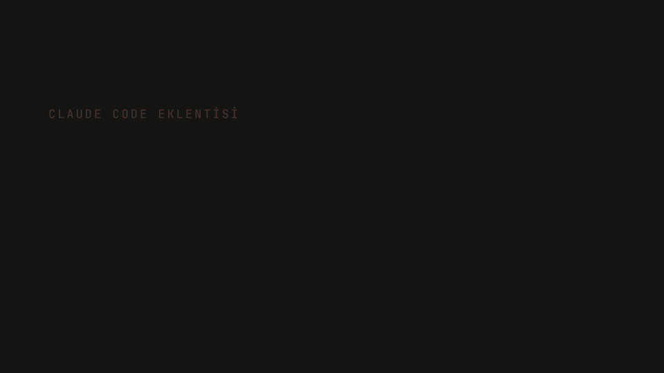

# cli-dispatch

> 🌐 **Diller:** [English](README.md) · **Türkçe**

**Claude Code'un işini DeepSeek, Gemini (Antigravity), OpenAI Codex, OpenCode (OpenRouter) ya da GitHub Copilot'a devret.** Claude Code'un kendi subagent'ları yalnız Anthropic modellerini çalıştırır; cli-dispatch bu beş CLI'ı `claude` oturumunun içinden worker olarak çalıştırır. Deterministik runner her işi bir git worktree'de izole eder, verify komutunu çalıştırır ve kısa bir sonuç döndürür: işi worker yapar, Claude Code gözden geçirir.



▶️ Video: [Türkçe](videos/demo-tr.mp4) · [English](videos/demo-en.mp4) · 📝 [Yazı (Medium)](https://medium.com/@rbinar/cli-dispatch-claudea-patron-deepseek-e-i%CC%87%C5%9F%C3%A7i-rol%C3%BC-veren-bir-plugin-b232803581fc)

## Kurulum

Bunları Claude Code içinde (önce `claude` yaz) sırayla, tek tek çalıştır:

```text
/plugin marketplace add rbinar/cli-dispatch
/plugin install cli-dispatch@cli-dispatch
/reload-plugins
/cli-dispatch:setup
```

Setup hangi backend'leri istediğini sorar ve wrapper'larını kurar. API key'leri yerel bir tarayıcı formuna girersin; Claude'dan hiç geçmezler. Sonucu `/cli-dispatch:doctor` ile kontrol et. Backend başına CLI, giriş ve model ayrıntıları: [Kurulum](docs/tr/install.md).

## Kullanım

**Sadece iste.** Claude işi `cli-dispatch:runner` agent'ına verir; agent worker'ı çalıştırır, sonucu doğrular ve incelemen için bir yama döndürür:

```text
add() in math.mjs is broken. Delegate the fix to DeepSeek, verify with node --test.
```

▶️ Uçtan uca örnek ([mp4](videos/cx-delegation-harness.mp4)): Claude düşen bir testi Codex'e devreder, `cli-dispatch:runner` agent'ını açıp ona gönderilen prompt'u birebir görürsün, Claude da doğrulanmış yamayı uygular. Bir sandbox container'ında canlı kaydedildi.

https://github.com/user-attachments/assets/efc498b1-48d1-4dc5-abcd-7a152d222578

**Kendin çalıştır.** Orkestrasyona LLM token'ı harcanmaz:

```text
/cli-dispatch:run cx "Fix add() in math.mjs" --verify 'node --test'
```

**Tek seferlik soru sor.** Salt-okunur, repo değişmez:

```text
/cli-dispatch:ask ds "Explain what this regex matches: ^\d{3}-\d{4}$"
```

Backend'ler: `ds` DeepSeek · `ag` Antigravity · `cx` Codex · `oc` OpenCode · `cp` Copilot. 12 komutun listesi `/cli-dispatch:help`'te, ayrıntılar [Komutlar](docs/tr/commands.md)'da.

> ⚠️ Worker'lar dosya yazabilir ve komut çalıştırabilir. Gerçek repo işi, yamayı sen uygulayana kadar bir git worktree'de kalır ([Güvenlik ve veri](docs/tr/security.md)).

## Güncelleme

```text
/plugin update cli-dispatch
/reload-plugins
/cli-dispatch:setup
```

Setup'ı yeniden çalıştırmak `~/.local/bin`'deki wrapper'ları tazeler; `/plugin update` onlara dokunmaz.

## Dokümantasyon

[Kurulum](docs/tr/install.md) · [Komutlar](docs/tr/commands.md) · [Deterministik runner](docs/tr/runner.md) · [Oturumlar](docs/tr/sessions.md) · [Politika enjeksiyonu](docs/tr/policy-injection.md) · [Statusline](docs/tr/statusline.md) · [Kullanım ve kota](docs/tr/quota.md) · [Özellikler](docs/tr/features.md) · [İç yapı](docs/tr/internals.md) · [Windows](docs/tr/windows.md) · [Güvenlik](docs/tr/security.md) · [Kaldırma](docs/tr/uninstall.md) · [Terminal referansı](TERMINAL.md) · [Değişiklik günlüğü](CHANGELOG.md)

## Lisans

MIT, bkz. [LICENSE](LICENSE).
